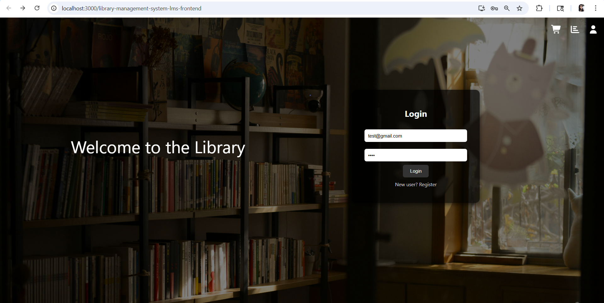

#  Library Management System - Frontend
This is the **React-based frontend** for the Library Management System (LMS).  
It provides a user interface for students to browse books, manage cart, and track their library activity.
---

## Features
- User Authentication (Login / Register)
- Dashboard navigation (Fiction, Non-Fiction, Study)
- Category-based book browsing
- Add books to cart
- Cart management with limit (max 5 books)
- Status tracking (issued books, return date)
- User profile view
- Responsive UI with modern design
---

## Tech Stack
- React.js
- React Router
- CSS
- LocalStorage (for cart & session handling)
- Fetch API (backend communication)
---

## Project Structure

library-management-system-lms-frontend/
│
├── build/                         # Production build files (auto-generated)
├── node_modules/                  # Installed dependencies (ignored in Git)
├── public/                        # Static public files
│   ├── index.html
│   └── favicon.ico
│
├── src/                           # Main React source code
│   │
│   ├── components/                # All UI components (no separate folders used)
│   │   │
│   │   ├── image/                 # Background images used in UI
│   │   │   ├── bg.jpg
│   │   │   └── dashboard-bg.jpg
│   │   │
│   │   ├── Book.js                # Book card component (expand + add to cart)
│   │   ├── Book.css
│   │   │
│   │   ├── Dashboard.js           # Main landing page after login
│   │   ├── Dashboard.css
│   │   │
│   │   ├── Login.js               # Login + Register UI
│   │   ├── Login.css
│   │   │
│   │   ├── FictionPage.js
│   │   ├── FictionPage.css
│   │   ├── FictionCategories.js   # Fetch + filter fiction books
│   │   │
│   │   ├── NonFictionPage.js
│   │   ├── NonFictionPage.css
│   │   ├── NonFictionCategories.js
│   │   │
│   │   ├── StudyPage.js
│   │   ├── StudyPage.css
│   │   ├── StudyCategories.js
│   │   │
│   │   ├── TopBar.js              # Cart, Status, Profile dropdown
│   │   ├── TopBar.css
│   │
│   ├── App.js                     # Main routing (React Router)
│   ├── App.css
│   ├── index.js                   # Entry point
│   ├── index.css
│   │
│   ├── App.test.js                # Default test file
│   ├── setupTests.js
│   ├── reportWebVitals.js
│   └── logo.svg
│
├── .gitignore
├── package.json
├── package-lock.json
├── LICENSE
└── README.md

### Note
This project currently keeps all components in a single folder (`components/`) for simplicity.  
In future versions, it can be refactored into a more scalable structure (e.g., separating pages, services, and hooks).
---

## Setup Instructions

### Install dependencies
```bash
npm install
```
---

### Run the application
```bash
npm start
```
---

### Access in browser
```
http://localhost:3000
```
---

## Backend Connection
This frontend connects to backend APIs running at:
```
http://localhost:5000
```

Example APIs used:
* `/api/auth/login`
* `/api/auth/register`
* `/api/books`
* `/api/transactions/user/:id`
---

## Business Logic (Frontend)
* Max **5 books allowed** (Cart + Issued)
* No duplicate books in cart
* Real-time cart updates using localStorage
* User session stored in localStorage
---

## Notes
* Backend must be running before using frontend
* Ensure correct API URL (`localhost:5000`)
* User must login before accessing dashboard
---

## Future Enhancements
* API integration with loading states
* Error handling improvements
* UI animations
* Deployment (Netlify / Vercel)
* Docker integration
---

## Author
Priyanka Srivastava
MCA Student | React Developer | DevOps Enthusiast
---

## License
MIT License

## UI Screenshots

### Login Page
![Login]
---

### Dashboard
![Dashboard]
---

### Fiction Categories
![Fiction]
---

### Cart
![Cart]
---